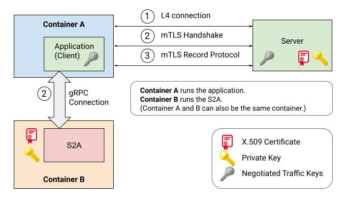

# Secure Session Agent

Secure Session Agent (S2A) is a side-car that enables applications to establish
secure connections with other applications or services using mTLS as a transport
layer security protocol. S2A offers full mTLS handshake offloading so that
applications do not have to hold the long-term private key material.
Specifically, S2A performs the handshake with the peer using the application
as a proxy for all handshake messages. After the handshake is complete, the S2A
hands off the negotiated session keys to the application where they are used in
the record protocol implementation to encrypt and decrypt data plane traffic.

The following describes a high level flow of client-side mTLS handshake offload
using the S2A. S2A also supports offloading of server-side mTLS handshakes.

1.  Client-server connection: A client application (gRPC or Envoy) establishes a
    connection to the server.
2.  mTLS handshake:
    1.  The client application establishes a bidirectional gRPC stream to the
        S2A. This stream is authenticated out-of-band in an environment specific
        way.
    2.  The client application initiates the handshake by communicating its
        intent to perform an mTLS handshake to the S2A.
    3.  S2A creates the first handshake message and sends it to the client
        application.
    4.  The client application (blindly) forwards the handshake message to the
        server over the connection established in Step 1.
    5.  When the client application receives a handshake message from the
        server, it forwards it to the S2A for processing.
    6.  Steps 2.iii, 2.iv and 2.v repeat until the handshake is complete.
    7.  When the handshake is complete, the S2A provides the negotiated session
        keys to the client application.
3.  Data transmission: the client and the server can now transmit data back and
    forth without the S2A’s involvement. This data is encrypted (and
    authenticated) using the negotiated session keys.
